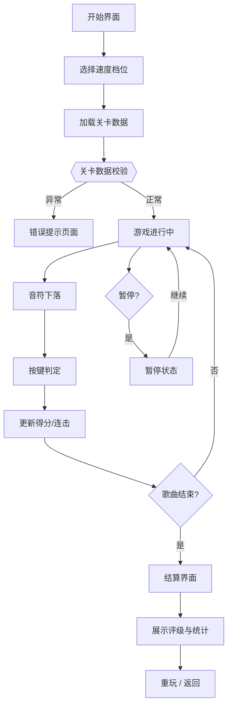

# 灵感捕捉节奏游戏 PRD

## 1. 产品概述

俱乐部入口的复古节奏机——灵感化作光点从上方落下，会员按键接住积累「灵感值」。一款四轨下落式节奏游戏，营造沉浸式俱乐部氛围体验。

- 核心玩法：四轨道下落音符，按键命中判定得分
- 目标用户：俱乐部会员、音乐游戏爱好者
- 产品价值：增强俱乐部入口互动体验，提升品牌调性

## 2. 核心功能

### 2.1 功能模块

1. **开始界面**：游戏标题、速度选择、开始按钮
2. **游戏界面**：四轨道下落、判定线、得分/连击显示、暂停按钮
3. **结算界面**：命中率、评级（S/A/B/C）、各项统计、重玩按钮

### 2.2 页面详情

| 页面名称 | 模块名称 | 功能描述 |
|---------|---------|---------|
| 开始界面 | 标题区域 | 复古霓虹灯效游戏标题「灵感捕捉」 |
| 开始界面 | 速度选择 | 两档速度切换（慢速/快速） |
| 开始界面 | 开始按钮 | 点击进入游戏 |
| 游戏界面 | 四轨道区域 | 四条轨道，音符从上方下落 |
| 游戏界面 | 判定线 | 底部判定线，按键命中判定 |
| 游戏界面 | HUD 面板 | 实时显示灵感值、连击数、得分倍率 |
| 游戏界面 | 判定反馈 | Perfect/Great/Miss 动画反馈 |
| 游戏界面 | 暂停按钮 | 暂停/继续游戏 |
| 结算界面 | 评级展示 | 大号 S/A/B/C 评级 |
| 结算界面 | 详细统计 | 命中率、Perfect 数、Great 数、Miss 数、最高连击、总得分 |
| 结算界面 | 操作按钮 | 重玩 / 返回主菜单 |

## 3. 核心流程

用户从开始界面选择速度后进入游戏，音符从四条轨道下落，用户在判定线附近按下对应按键，系统判定命中等级并累计得分与连击，歌曲结束后进入结算界面展示评级。

## 4. 用户界面设计

### 4.1 设计风格

**复古霓虹 / 赛博朋克俱乐部风格**

- **主色调**：深紫 (#1a0a2e) + 霓虹粉 (#ff2e88) + 霓虹青 (#00f0ff)
- **辅助色**：暖黄 (#ffd93d) 用于 Perfect，橙 (#ff6b35) 用于 Great，灰紫 (#6b5b95) 用于 Miss
- **背景**：深色渐变 + 网格纹理 + 微弱噪点，营造复古街机感
- **字体**：展示字体使用霓虹风格（Orbitron），正文字体使用简洁无衬线
- **按钮**：霓虹发光边框 + 悬停发光增强 + 按下内陷效果
- **轨道**：半透明玻璃质感，底部有霓虹判定线发光
- **音符**：发光光点，带拖尾效果，不同轨道不同颜色

### 4.2 页面设计概览

| 页面名称 | 模块名称 | UI 元素 |
|---------|---------|---------|
| 开始界面 | 标题 | 霓虹发光文字，闪烁动画，居中偏上 |
| 开始界面 | 速度选择 | 两个霓虹按钮并排，选中态有强发光 |
| 开始界面 | 开始按钮 | 大号霓虹按钮，呼吸动画 |
| 游戏界面 | 轨道区 | 四条垂直轨道，深色半透明，有分隔线 |
| 游戏界面 | 判定线 | 底部横向发光线，按键时闪烁 |
| 游戏界面 | 音符 | 圆形发光体，带拖尾，下落有速度感 |
| 游戏界面 | HUD | 左上：灵感值（分数），右上：连击数 + 倍率 |
| 游戏界面 | 判定反馈 | 判定文字从判定线处弹出，渐隐上浮 |
| 结算界面 | 评级 | 超大号字母，霓虹发光，居中 |
| 结算界面 | 统计 | 两列布局，各项数据清晰展示 |
| 结算界面 | 按钮 | 底部两个操作按钮 |

### 4.3 响应式

- 桌面端优先，固定尺寸游戏区域（480×640）
- 移动端自适应缩放，支持触摸操作
- 键盘按键：D / F / J / K 对应四条轨道
- 触屏：点击四条轨道区域对应按键

### 4.4 动效设计

- **音符下落**：匀速下落，带轻微发光拖尾
- **命中反馈**：Perfect 金色光晕扩散，Great 橙色光晕，Miss 灰色碎裂
- **连击数字**：连击增加时数字弹跳放大
- **评级出现**：从模糊到清晰，伴随光晕扩散
- **页面切换**：淡入淡出 + 轻微缩放过渡
- **暂停**：画面模糊变暗，暂停面板滑入
