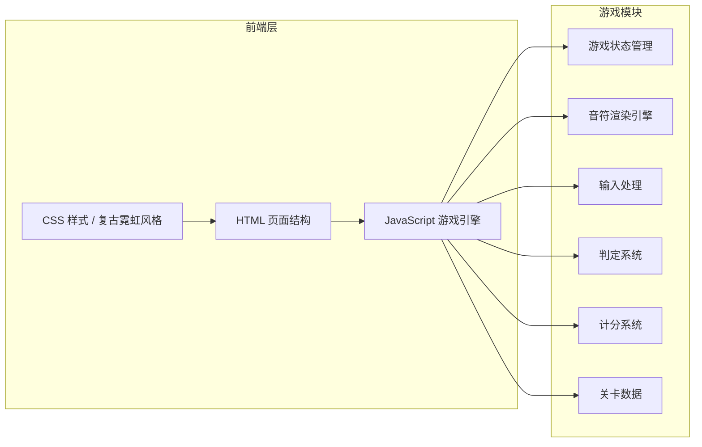

# 灵感捕捉节奏游戏 - 技术架构文档

## 1. 架构设计

纯前端单页游戏应用，使用原生 HTML5 Canvas 渲染游戏画面，JavaScript 实现游戏逻辑。



## 2. 技术描述

- **前端**：原生 HTML5 + CSS3 + JavaScript (ES6+)
- **渲染**：HTML5 Canvas 2D
- **构建**：无需构建工具，纯静态文件
- **数据**：内置 Mock 关卡数据（JSON 格式）
- **部署**：纯静态，可直接在浏览器运行

**技术选型理由：**
- 游戏逻辑相对独立，不需要框架 overhead
- Canvas 2D 足以满足 2D 下落节奏游戏的渲染需求
- 原生 JS 保证最佳性能和最小体积
- 方便在俱乐部入口设备上直接运行

## 3. 页面/状态定义

| 状态 | 描述 |
|------|------|
| menu | 开始菜单界面 |
| playing | 游戏进行中 |
| paused | 游戏暂停 |
| result | 结算界面 |
| error | 错误提示界面 |

## 4. 核心数据结构

### 4.1 关卡数据格式

```typescript
interface Note {
  time: number;      // 音符出现时间（毫秒）
  lane: number;      // 轨道索引 0-3
  type: 'tap' | 'hold'; // 音符类型
  duration?: number; // 长按音符持续时间（毫秒）
}

interface LevelData {
  title: string;     // 关卡名称
  bpm: number;       // 节拍速度
  totalTime: number; // 总时长（毫秒）
  notes: Note[];     // 音符列表
}
```

### 4.2 游戏状态

```typescript
interface GameState {
  status: 'menu' | 'playing' | 'paused' | 'result' | 'error';
  speed: 'slow' | 'fast';  // 速度档位
  score: number;           // 总得分（灵感值）
  combo: number;           // 当前连击数
  maxCombo: number;        // 最高连击
  perfectCount: number;    // Perfect 次数
  greatCount: number;      // Great 次数
  missCount: number;       // Miss 次数
  currentTime: number;     // 当前游戏时间
  notes: NoteState[];      // 音符状态列表
  errorMessage?: string;   // 错误信息
}

interface NoteState {
  data: Note;
  hit: boolean;       // 是否已命中
  missed: boolean;    // 是否已 Miss
  holdActive: boolean; // 长按是否激活中
}
```

### 4.3 判定配置

```typescript
const JUDGE_CONFIG = {
  perfect: 50,   // Perfect 判定窗口 ±50ms
  great: 120,    // Great 判定窗口 ±120ms
  miss: 180,     // Miss 判定窗口（超过此时间视为 Miss）
};

const SCORE_CONFIG = {
  perfect: 100,
  great: 50,
  comboBonusStep: 10,  // 每 10 连击增加 1 倍率
  maxMultiplier: 4,    // 最大倍率
  highComboBonus: 500, // 高连击额外奖励（每 50 连击）
};
```

## 5. 核心模块设计

### 5.1 游戏引擎 (GameEngine)

- 主循环：requestAnimationFrame 驱动
- 状态机：管理 menu/playing/paused/result/error 状态
- 时间管理：游戏时钟、暂停恢复

### 5.2 渲染引擎 (Renderer)

- Canvas 绘制轨道、音符、判定线
- 粒子效果：命中时的光晕、拖尾
- HUD 绘制：分数、连击、倍率

### 5.3 输入系统 (InputManager)

- 键盘事件监听：D/F/J/K 对应 4 条轨道
- 触摸事件支持
- 按键按下/抬起事件处理（用于长按）

### 5.4 判定系统 (JudgeSystem)

- 按键时查找最近的音符
- 计算时间差，判定 Perfect/Great/Miss
- 长按音符的持续判定

### 5.5 计分系统 (ScoreSystem)

- 基础分 × 连击倍率
- 连击数维护（Miss 断连）
- 高连击额外加分
- 命中率与评级计算（S/A/B/C）

### 5.6 关卡校验 (LevelValidator)

- 检查关卡数据格式
- 验证时间顺序
- 验证轨道索引范围
- 异常时返回友好错误信息

## 6. 评级标准

| 评级 | 命中率要求 |
|------|-----------|
| S | ≥ 95% |
| A | ≥ 85% |
| B | ≥ 70% |
| C | < 70% |

命中率 = (Perfect×1 + Great×0.5) / 总音符数 × 100%

## 7. 文件结构

```
byq-0613-122/
├── index.html              # 主页面
├── css/
│   └── style.css           # 样式文件
├── js/
│   ├── main.js             # 入口文件
│   ├── game/
│   │   ├── engine.js       # 游戏引擎
│   │   ├── renderer.js     # 渲染引擎
│   │   ├── input.js        # 输入管理
│   │   ├── judge.js        # 判定系统
│   │   └── score.js        # 计分系统
│   ├── data/
│   │   └── levels.js       # 关卡数据
│   └── utils/
│       └── validator.js    # 数据校验
└── .trae/
    └── documents/
        ├── PRD.md
        └── tech-architecture.md
```
